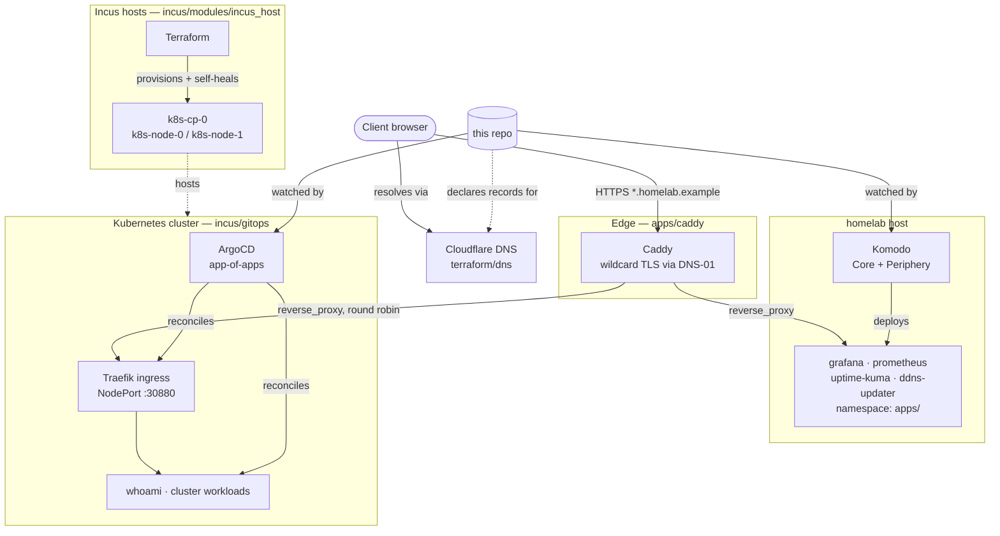

# gitops-homelab

A curated, sanitized slice of my actual homelab setup: a monorepo-driven,
config-as-code home infrastructure stack. No dashboards clicked into
existence — every container, DNS record, dataset, and VM is declared
somewhere in git and reconciled by a tool that watches that git repo.

This is **not** a 1:1 copy of my private repo (no real domain, no real IPs,
no real credentials, and a lot of apps trimmed out) — it's the interesting
patterns, kept honest enough that they'd still work if you filled in your
own values.

## Architecture

Two independent GitOps loops watch the same repo and deploy to two different
targets: **Komodo** deploys plain `docker-compose.yml` stacks straight to the
homelab host, while **ArgoCD** reconciles Kubernetes manifests onto a small
cluster running on **Incus** VMs that Terraform provisions. **Caddy** is the
single point where both worlds meet the outside world — it's the only thing
that ever requests a TLS certificate, and it fans traffic out to either a
Komodo-deployed container or, via Traefik's NodePort, into the cluster.
**Terraform** additionally owns the DNS records that point at Caddy and the
ZFS datasets backing everything's persistent storage (not shown above — see
[`terraform/truenas/`](terraform/truenas)).

## The pieces

| Layer | Tool | Lives in |
|---|---|---|
| Container deploy | [Komodo](https://komo.do) — polls a git repo, deploys `docker-compose.yml` stacks it finds there | [`komodo.toml`](komodo.toml), [`apps/`](apps/) |
| Edge routing + TLS | [Caddy](https://caddyserver.com), config-as-code, single wildcard cert via DNS-01 | [`apps/caddy/`](apps/caddy) |
| DNS records | Terraform (Cloudflare provider), import-first | [`terraform/dns/`](terraform/dns) |
| NAS storage datasets | Terraform (TrueNAS provider) | [`terraform/truenas/`](terraform/truenas) |
| VM/container provisioning (Incus) | Terraform module, cloud-init, self-healing systemd units | [`incus/modules/incus_host/`](incus/modules/incus_host) |
| Kubernetes cluster GitOps | ArgoCD app-of-apps, watching a plain directory of `Application` manifests | [`incus/gitops/`](incus/gitops) |

## Why this shape

The starting point was a cron job that just ran `docker compose up -d` over
every folder in `apps/`. It worked as a simple baseline, but it couldn't tell
you *why* something changed, didn't reconcile per-stack, and had no concept
of "this stack lives on that specific host." [Komodo](https://komo.do)
replaced it for that reason: one `komodo.toml` declares every stack **and**
which server it belongs to, and a scheduled procedure pulls + diffs + redeploys
only what changed.

Everything downstream follows the same instinct — replace UI state with a
git-diffable file:

- **Caddy** replaced an nginx-proxy-manager instance that kept routing in a
  SQLite DB with no export. The `Caddyfile` is the single source of truth;
  a `Caddyfile`-only change gets picked up automatically because of a small
  hash trick in `apps/caddy/docker-compose.yml` (see the comment at the top
  of that file) that forces Komodo to see the stack as "changed."
- **DNS and NAS datasets** were the last pieces still driven by hand-clicking
  in the Cloudflare dashboard and the TrueNAS UI — moved to Terraform,
  adopting existing state with `import` blocks rather than recreating
  anything.
- **The Kubernetes cluster** (deliberately hand-rolled — following Kelsey Hightower's ["Kubernetes The Hard Way"](https://github.com/kelseyhightower/kubernetes-the-hard-way), not a managed distro) uses the same idea one layer up: ArgoCD
  watches one directory of `Application` manifests and reconciles it, so
  adding a workload is "merge a YAML file," not "also remember to run
  `kubectl apply`."

## What's deliberately left out

- Actual secrets, tokens, and API keys — every example below uses env vars
  or a gitignored `.env`.
- The real domain and internal IP ranges — replaced with `homelab.example`
  and `192.168.1.0/24` throughout.
- Most of the ~30 apps in the real repo (media server, photo library, wiki,
  etc.) — they're all the same `docker-compose.yml` shape as the ones kept
  here, so nothing is lost by trimming them.
- Company/environment-specific stacks that don't generalize to "homelab."

## Bootstrapping Komodo

To sync your infrastructure resources to Komodo, perform these one-time UI steps:

1. **Create a Git Account (Project Token):**
   * Create a project access token on your git host with `read` + `write` repository access. Give it Maintainer-equivalent access so it can perform writes back to the repo if necessary.
   * In Komodo: **Settings > Providers > Git Accounts > Add Account**
     * Name: `oauth2`
     * Username: `oauth2` (a literal string — required for token auth on some providers)
     * Password/Token: paste your personal access token.
2. **Create the Server:**
   * Name: `homelab` (must match the `[[server]]` name in `komodo.toml`).
   * Address: `http://komodo-periphery:8120` (reached over the shared docker network).
3. **Create the Repository Resource:**
   * Name: `gitops-homelab`
   * Account: `oauth2`
   * Path: `youruser/gitops-homelab`
4. **Create the Resource Sync:**
   * Name: `resources`
   * File: `komodo.toml`

From here, committing changes to `komodo.toml` is enough to manage your stacks and servers. Ensure that `komodo.toml` does NOT contain raw tokens—only reference the Git account name (`git_account = "oauth2"`).

## License

Apache License 2.0 — see [`LICENSE`](LICENSE).
