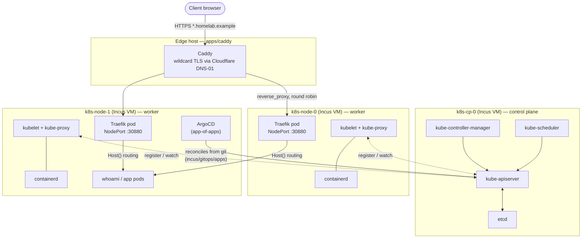

# incus — VM/container provisioning + cluster GitOps

This directory contains infrastructure provisioning modules and Kubernetes GitOps configurations that sit below the standard container application layer.

It is split into two main parts:
* **`modules/incus_host/`** — A Terraform module that provisions containers or virtual machines via cloud-init.
* **`gitops/`** — Declarative ArgoCD manifests for managing a hand-rolled Kubernetes cluster.

---

## 🔧 Host Provisioning Module (`modules/incus_host`)

The `modules/incus_host` directory houses a reusable Terraform module that provisions an [Incus](https://linuxcontainers.org/incus/) container or KVM virtual machine. 

### Why this is a separate concern
In the real homelab setup, this lives in its own repository (`incus-infra`). It represents the physical/virtual layer below applications—setting up hosts, system packages, and docker daemons. It is decoupled from the deployment of actual application containers.

### Module Features

* **Dual Mode Support:** Can provision lightweight LXC system containers (`container`) or full KVM Virtual Machines (`virtual-machine`).
* **Static Networking:** Supports bridged static IP configuration with default gateway routing and custom DNS nameservers.
* **Persistent Drift Correction:** Unlike standard cloud-init, which only runs once on first boot, this module uses `null_resource` and `local-exec` to re-apply package lists, Docker networks, and agents on subsequent `terraform apply` runs.
* **Automatic Agents Installer:**
  - **Docker CE:** Automatic installation of the official Docker runtime and network configurations.
  - **Komodo Periphery:** Installs the agent to register the host with your Komodo Core control plane.
  - **Portainer Agent:** Installs the agent to link the host back to a central Portainer admin UI.

### Usage Example

```hcl
module "worker_nodes" {
  source                = "./modules/incus_host"
  name                  = "k8s-node-0"
  instance_type         = "virtual-machine"
  root_disk_size        = "40GiB"
  cpu_cores             = 4
  memory_mib            = 8192
  admin_ssh_public_key  = var.ssh_key
  static_ipv4           = "192.168.1.41"
  gateway_ipv4          = "192.168.1.1"

  install_docker        = true
  docker_networks       = ["shared-network"]
}
```

### Module Inputs

| Name | Type | Description | Default |
|---|---|---|---|
| `name` | `string` | Instance hostname and container name. | — |
| `incus_remote` | `string` | Local `incus` CLI remote configuration target. | `"homelab"` |
| `image` | `string` | OS image source (must be a cloud-init variant). | `"images:ubuntu/24.04/cloud"` |
| `instance_type` | `string` | `"container"` or `"virtual-machine"`. | `"container"` |
| `root_disk_size` | `string` | Virtual disk size (required for VMs). | `null` |
| `cpu_cores` | `number` | Pinned CPU core limit. | `4` |
| `memory_mib` | `number` | RAM allocation limit in MiB. | `8192` |
| `static_ipv4` | `string` | IPv4 address (omitting prefix). | `null` |
| `gateway_ipv4` | `string` | Default gateway IPv4. | `null` |
| `dns_servers` | `list(string)`| Custom DNS resolvers. | `["1.1.1.1", "8.8.8.8"]` |
| `install_docker` | `bool` | Installs Docker CE on target. | `true` |
| `docker_networks` | `list(string)`| Pre-created docker network interfaces. | `[]` |

### Module Outputs

| Name | Description |
|---|---|
| `name` | Pinned hostname/instance name. |
| `ipv4_address` | Assigned static IP. |
| `ssh_command` | SSH console shell helper. |

---

## ☸️ Kubernetes Cluster GitOps (`gitops`)

The [`gitops/`](gitops) directory contains declarative ArgoCD `Application` manifests for a small, hand-rolled Kubernetes cluster built by following Kelsey Hightower's [Kubernetes The Hard Way](https://github.com/kelseyhightower/kubernetes-the-hard-way). 

### Cluster Architecture & Request Path



* **Control Plane (`k8s-cp-0`):** Runs the core system components (`kube-apiserver`, `etcd`, `kube-controller-manager`, `kube-scheduler`) configured as manual systemd services (no managed distros).
* **Worker Nodes (`k8s-node-0`/`k8s-node-1`):** Run the container runtime (`containerd`), `kubelet`, and `kube-proxy`. Workloads like Traefik and ArgoCD are scheduled directly onto these nodes.
* **Edge Proxy Routing:** Caddy (the edge proxy outside the cluster) handles ACME wildcard certificate issuance. It terminates HTTPS at the edge and round-robins requests to Traefik's pinned NodePort (`30880`) on the worker nodes. Traefik then routes requests inside the cluster by `Host()` headers.

### Why ArgoCD is the Exception
ArgoCD is bootstrapped using Terraform rather than files in this directory. Because GitOps relies on ArgoCD running in order to reconcile, the bootstrap must happen first.

### How this works: App-of-Apps
The [`root-application.yaml`](gitops/root-application.yaml) is the only manifest ever applied to the cluster manually:
```bash
kubectl --kubeconfig <admin.kubeconfig> apply -f gitops/root-application.yaml
```

ArgoCD watches the [`gitops/apps/`](gitops/apps) directory. Adding, editing, or deleting files in that directory automatically reconciles workloads in the cluster.

To allow ArgoCD to pull this directory, create an SSH deploy key secret in the cluster:
```bash
kubectl -n argocd create secret generic gitops-homelab-repo \
  --from-literal=type=git \
  --from-literal=url=git@github.com:youruser/gitops-homelab.git \
  --from-file=sshPrivateKey=<private-key-file>
kubectl -n argocd label secret gitops-homelab-repo argocd.argoproj.io/secret-type=repository
```

### Manifests Included
* **[`root-application.yaml`](gitops/root-application.yaml)** — The root app-of-apps coordinator.
* **[`gitops/apps/traefik-application.yaml`](gitops/apps/traefik-application.yaml)** — Declares the Helm chart deployment for Traefik ingress, pinned to NodePort `30880`.
* **[`gitops/apps/whoami-application.yaml`](gitops/apps/whoami-application.yaml)** / **[`whoami-ingressroute.yaml`](gitops/apps/whoami-ingressroute.yaml)** — A test server stack used to verify routing.

### Explicitly Excluded
* **cert-manager:** Omitted in favor of edge proxy termination (Caddy) to avoid rate limits and duplicate DNS challenges.
* **Cilium / CNI NetworkPolicy:** Standard `bridge` configuration suffices for host learning.
* **CSI Storage Drivers:** All cluster applications are currently stateless.
